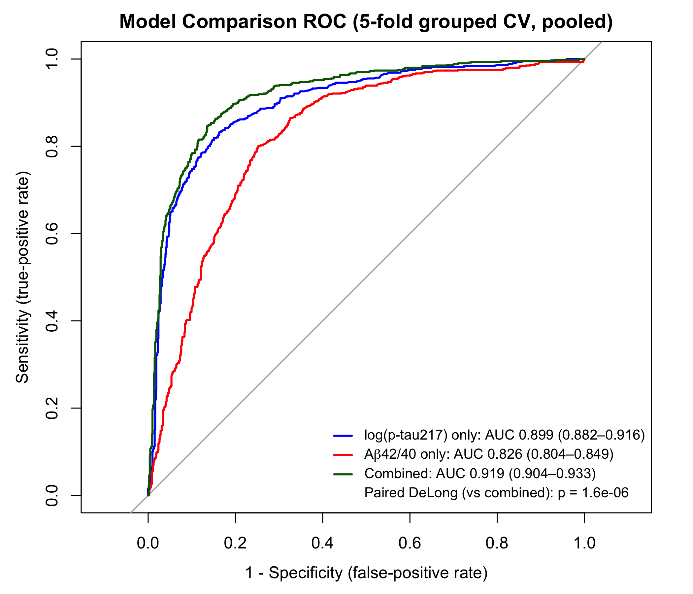

# Plasma p-tau217 and Aβ42/40 Classification of Amyloid-PET Status in ADNI

## Intro

This repository contains a reproducible R analysis that classifies amyloid-PET status from two plasma biomarkers in the ADNI cohort: **plasma p-tau217** and **Aβ42/40 ratio**.
The main methodological focus is on issues that are easy to get wrong in clinical datasets:

- repeated visits from the same participant;
- within-subject train/test leakage;
- whether Aβ42/40 adds value beyond p-tau217;
- arbitrary clinical thresholds;
- temporal mismatch between plasma draw and PET scan dates;
- collinearity and interaction between biologically related biomarkers.

**Headline result:** in participant-grouped 5-fold cross-validation, the combined plasma p-tau217 + Aβ42/40 logistic-regression model achieved a pooled out-of-fold CV-AUC of approximately **0.92**.



---

## Background

Amyloid-PET is a reference-standard method for assessing brain amyloid status, but it is expensive, capacity-limited, and not always available in routine clinical settings. Blood-based biomarkers are being studied as scalable pre-screening tools that could help identify individuals who may need confirmatory amyloid-PET or CSF testing.

This project uses ADNI data to reproduce a clinically relevant screening task:

> Can plasma p-tau217 and Aβ42/40 classify amyloid-PET positivity, and does Aβ42/40 add useful discrimination once p-tau217 is already included?

The analysis is intentionally confirmatory. The emphasis is on rigorous data handling, transparent validation, and honest interpretation of incremental model improvement.

---

## Data

### Source tables

The script uses three ADNI source CSV files:

| File | Role in analysis |
|---|---|
| `UPENN_PLASMA_FUJIREBIO_QUANTERIX_31Mar2026.csv` | Plasma biomarkers: p-tau217, Aβ42, Aβ40, Aβ42/40, NfL, GFAP |
| `UCBERKELEY_AMY_6MM_31Mar2026.csv` | Amyloid-PET status and PET scan date |
| `DXSUM_31Mar2026.csv` | Diagnosis labels: CN, MCI, AD |

The script has a helper function that also accepts local duplicate filenames such as:

```text
UPENN_PLASMA_FUJIREBIO_QUANTERIX_31Mar2026(2).csv
UCBERKELEY_AMY_6MM_31Mar2026(2).csv
DXSUM_31Mar2026(2).csv
```

Raw ADNI data are **not redistributed** in this repository. Users must apply for ADNI/LONI access and download the source CSV files directly under the ADNI Data Use Agreement.

### Analytic dataset

After cleaning, merging, and temporal filtering, the primary analytic dataset contains:

| Quantity | Value |
|---|---:|
| Plasma–PET visit pairs | 1,411 |
| Unique participants | 1,164 |
| Amyloid-negative visit pairs | 804 |
| Amyloid-positive visit pairs | 607 |
| Participants with >1 visit | ~20.6% |
| Median absolute plasma–PET gap | 9 days |
| Maximum allowed plasma–PET gap | 365 days |

The repeated-visit structure is important: because some participants contribute more than one visit, random row-level train/test splitting would leak participant-specific signal. This is why the primary validation uses participant-grouped cross-validation.

---

## Methods

### Data cleaning and linkage

The script:

1. reads the three ADNI source tables and standardizes column names with `janitor::clean_names()`;
2. creates one plasma record per participant-visit using `rid` and `viscode2`;
3. converts negative-coded biomarker values to `NA`;
4. removes rows missing either `ptau217` or `ab_ratio` using `drop_na(ptau217, ab_ratio)`;
5. keeps one PET record per participant-visit;
6. merges plasma, PET, and diagnosis data by `rid + viscode2`;
7. calculates the absolute gap between plasma draw date and PET scan date;
8. keeps plasma–PET pairs within `GAP_DAYS_MAX = 365` days;
9. recodes amyloid-PET status as `Negative` / `Positive`;
10. recodes diagnosis as `CN` / `MCI` / `AD`.

### Preprocessing

The current R code does **not** use median imputation.

Rows with missing p-tau217 or Aβ42/40 are removed during plasma cleaning:

```r
drop_na(ptau217, ab_ratio)
```

The modeling recipes then apply:

1. log transformation of p-tau217 with offset `0.001`;
2. standardization of numeric predictors.

In the current code, the main recipes are:

```r
recipe(amyloid_status ~ ptau217 + ab_ratio, data = dat) %>%
  step_log(ptau217, offset = 0.001) %>%
  step_normalize(all_numeric_predictors())
```

For the Aβ42/40-only model, only standardization is applied:

```r
recipe(amyloid_status ~ ab_ratio, data = dat) %>%
  step_normalize(all_numeric_predictors())
```

### Models

Three logistic-regression models are fit using `tidymodels` with the `glm` engine:

| Model | Formula concept |
|---|---|
| p-tau217 only | `amyloid_status ~ log(ptau217)` |
| Aβ42/40 only | `amyloid_status ~ ab_ratio` |
| Combined additive model | `amyloid_status ~ log(ptau217) + ab_ratio` |

The interaction sensitivity model is also evaluated:

```r
amyloid_status ~ log(ptau217) * ab_ratio
```

### Validation strategy

The primary validation uses participant-grouped 5-fold cross-validation:

```r
group_vfold_cv(dat, group = rid, v = 5)
```

All visits from the same participant are kept in the same fold. This prevents a participant from appearing in both training and test data.

Each visit-pair receives one pooled out-of-fold prediction from a model that did not train on that participant. The same folds are reused across all models so that model comparisons are paired on identical out-of-fold test cases.

### Evaluation

The script reports:

- pooled out-of-fold ROC-AUC;
- bootstrap 95% confidence intervals for AUC;
- paired DeLong comparison of p-tau217 alone vs combined model;
- operating metrics at the default 0.5 threshold;
- threshold sensitivity using Youden and sensitivity-targeted thresholds;
- GEE and GLMM repeated-measures sensitivity models;
- temporal-window sensitivity analysis;
- collinearity checks using correlation and VIF-style diagnostics;
- interaction-model comparison using likelihood-ratio testing and out-of-fold ΔAUC.

---

## Results

### Cross-validated discrimination

Primary pooled out-of-fold results:

| Model | Pooled CV-AUC | 95% CI |
|---|---:|---:|
| log(p-tau217) only | 0.899 | 0.882–0.916 |
| Aβ42/40 only | 0.826 | 0.804–0.849 |
| Combined | 0.919 | 0.904–0.933 |

The combined model improves AUC by approximately **+0.02** over p-tau217 alone.

### Model comparison

The script compares the p-tau217-only model with the combined model using a paired DeLong test on pooled out-of-fold predictions:

```text
p-tau217 alone vs combined
AUC 0.899 vs 0.919
p ≈ 1.6e-06
```

Because some participants contribute repeated visits, this visit-level DeLong p-value is treated as supportive rather than as fully participant-clustered inference.

### Default operating point

At a default 0.5 probability threshold, the combined model reaches approximately:

| Metric | Estimate |
|---|---:|
| Accuracy | 0.85 |
| Sensitivity | 0.80 |
| Specificity | 0.89 |
| PPV | 0.84 |
| NPV | 0.85 |

The 0.5 threshold is reported as a default machine-learning operating point, not as an optimized clinical cut-off.

### Interpretation

p-tau217 is the dominant predictor. Aβ42/40 is weaker as a single marker but adds a small, statistically detectable amount of discrimination beyond p-tau217. The improvement is meaningful as a reproducible model-comparison result, but it should not be overstated as a standalone clinical validation claim.

---

## Robustness

The script includes several robustness checks designed to address common PI-level critiques of clinical biomarker modeling.

### 1. Repeated-measures sensitivity: GEE and GLMM

Grouped cross-validation prevents train/test leakage, but standard logistic regression still treats visit pairs as independent during coefficient estimation. To address this, the script adds two cluster-aware sensitivity models:

```r
geepack::geeglm(
  y ~ log_ptau217_z + ab_ratio_z,
  id = rid,
  family = binomial,
  corstr = "exchangeable"
)
```

and

```r
lme4::glmer(
  y ~ log_ptau217_z + ab_ratio_z + (1 | rid),
  family = binomial
)
```

These models are used for coefficient-inference sensitivity, not as replacements for the grouped-CV predictive evaluation.

### 2. Threshold sensitivity

The script reports the default 0.5 threshold and also evaluates:

- Youden-index threshold;
- sensitivity-targeted threshold at 0.90;
- sensitivity-targeted threshold at 0.95.

This is important because a blood-based screening tool may prioritize sensitivity over balanced accuracy. These thresholds remain exploratory because they are selected from the same dataset and require external validation.

Output file:

```text
threshold_sensitivity_table.csv
```

### 3. Temporal-window sensitivity

The primary analysis allows plasma–PET pairs within 365 days. To test whether results are driven by temporally distant pairs, the script reruns the grouped-CV workflow using stricter matching windows:

```r
GAP_SENSITIVITY_WINDOWS <- c(30, 90, 180, 365)
```

Output file:

```text
temporal_window_sensitivity_table.csv
```

### 4. Collinearity checks

Because p-tau217 and Aβ42/40 are biologically related to amyloid pathology, the script checks their association using:

- Pearson correlation;
- Spearman correlation;
- `performance::check_collinearity()` if available;
- manual VIF fallback if `performance` is not installed.

Output files:

```text
biomarker_correlation_table.csv
collinearity_vif_table.csv
```

### 5. Interaction check

The script tests whether a p-tau217 × Aβ42/40 interaction adds value beyond the additive combined model.

It uses:

1. a likelihood-ratio test comparing additive vs interaction GLMs;
2. out-of-fold AUC comparison between the additive combined model and the interaction model;
3. paired DeLong comparison for ΔAUC.

Output file:

```text
interaction_comparison_table.csv
```

---

## Limitations

This project should be interpreted as a reproducible methods demonstration, not a clinically validated diagnostic tool.

Main limitations:

- single-cohort ADNI analysis;
- cross-sectional amyloid-PET classification rather than longitudinal prediction;
- amyloid status is defined by PET thresholding rather than autopsy;
- Aβ42/40 is measured by immunoassay rather than mass spectrometry;
- p-tau217 unit should be verified against the exact ADNI UPENN plasma data dictionary before publication-level use;
- DeLong testing and bootstrap AUC confidence intervals are based on pooled visit-level predictions and are not fully participant-clustered inference;
- threshold selection is exploratory and requires external validation;
- GEE/GLMM sensitivity models support coefficient interpretation but do not replace external validation.

---

## Reproduce

### Requirements

R version 4.3 or higher is recommended.

Install the required packages:

```r
install.packages(c(
  "tidyverse",
  "tidymodels",
  "janitor",
  "lubridate",
  "pROC",
  "broom"
))
```

Optional packages for sensitivity analyses:

```r
install.packages(c(
  "geepack",
  "lme4",
  "performance"
))
```

If optional packages are missing, the script skips the corresponding sensitivity section and continues with the main analysis.

### Data access

Apply for ADNI access and download the required CSV files directly from ADNI/LONI. Place the files in the same working directory as the R script.

Required source files:

```text
UPENN_PLASMA_FUJIREBIO_QUANTERIX_31Mar2026.csv
UCBERKELEY_AMY_6MM_31Mar2026.csv
DXSUM_31Mar2026.csv
```

Local duplicate filenames with suffixes such as `(2)` are also accepted by the script.

### Run

```bash
Rscript ADNI_plasma_biomarker.R
```

The script prints cohort diagnostics, AUC tables, DeLong results, threshold metrics, repeated-measures sensitivity models, temporal-window sensitivity, collinearity diagnostics, interaction tests, and final coefficient summaries.

It also writes figures and CSV outputs to the working directory.

---

## Files

### Main repository files

| File | Description |
|---|---|
| `README.md` | Project overview, methods, results, limitations, and reproduction instructions |
| `ADNI_plasma_biomarker.R` | Full R analysis script |
| `.gitignore` | Recommended file for excluding raw ADNI data and local R artifacts |
| `LICENSE` | Optional license for repository code |

### Required local input files

These files are required to reproduce the analysis but should **not** be committed to GitHub:

| File | Description |
|---|---|
| `UPENN_PLASMA_FUJIREBIO_QUANTERIX_31Mar2026.csv` | ADNI plasma biomarker table |
| `UCBERKELEY_AMY_6MM_31Mar2026.csv` | UC Berkeley amyloid-PET table |
| `DXSUM_31Mar2026.csv` | ADNI diagnosis summary table |

Recommended `.gitignore` entries:

```gitignore
*.csv
*.xlsx
*.rds
*.RData
.Rhistory
.Rproj.user/
.DS_Store
data/
raw_data/
```

If committing derived output CSVs, use more specific ignore rules so raw data remain excluded.

### Files generated by the script

| Output | Description |
|---|---|
| `model_comparison_roc.png` | ROC curves for p-tau217, Aβ42/40, and combined models |
| `ptau217_boxplot.png` | p-tau217 distribution by amyloid-PET status |
| `biomarker_scatter.png` | p-tau217 vs Aβ42/40 colored by amyloid-PET status |
| `auc_table.csv` | Pooled CV-AUC table with bootstrap 95% CIs |
| `threshold_sensitivity_table.csv` | Default, Youden, and sensitivity-targeted threshold metrics |
| `temporal_window_sensitivity_table.csv` | AUC sensitivity across plasma–PET matching windows |
| `biomarker_correlation_table.csv` | Pearson and Spearman biomarker correlation results |
| `collinearity_vif_table.csv` | VIF-style collinearity diagnostics |
| `interaction_comparison_table.csv` | Additive vs interaction model comparison |

